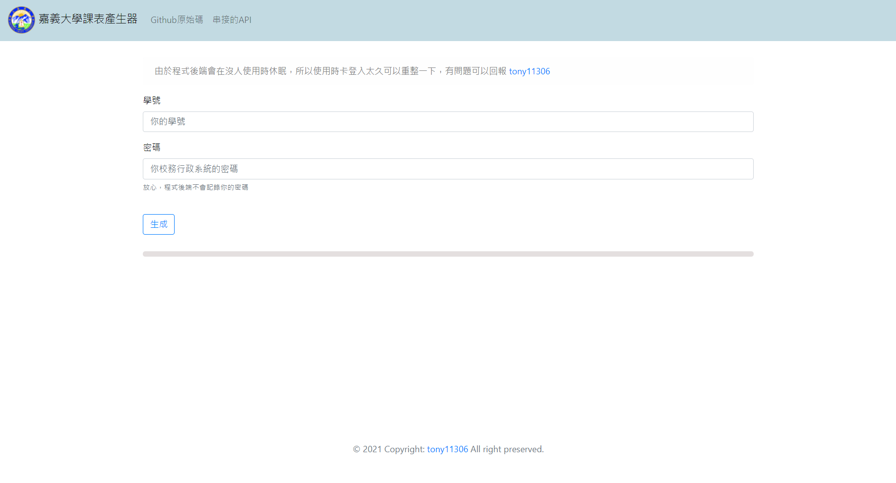
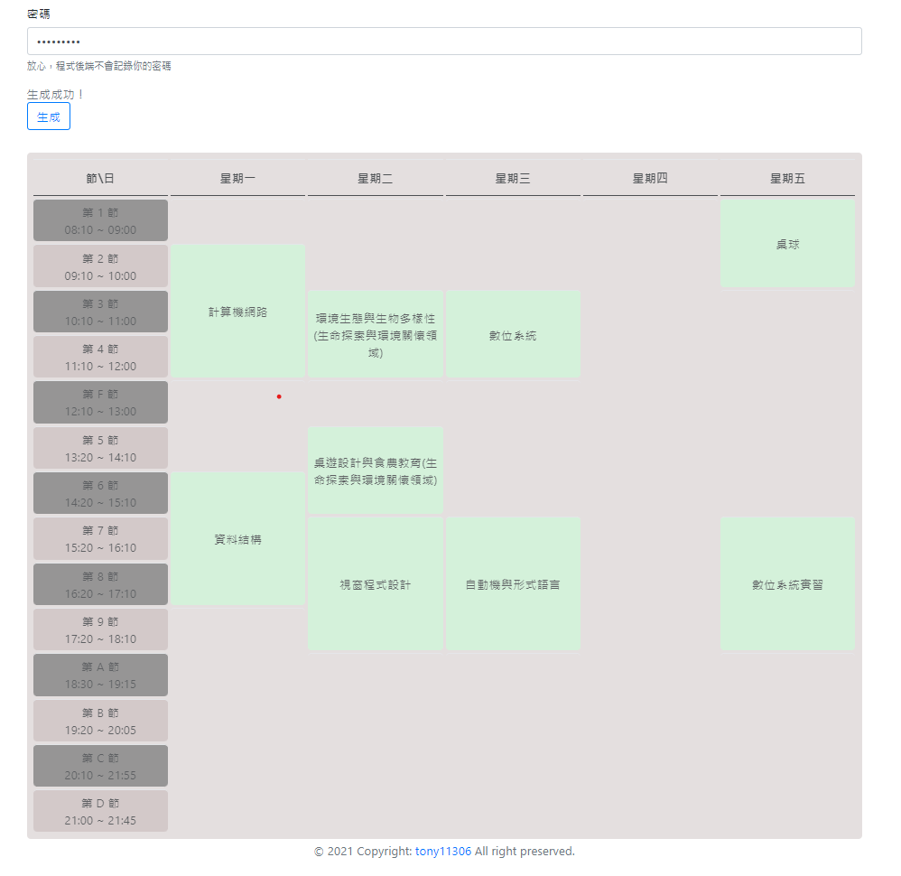

# [嘉義大學課表產生器](https://tony11306.github.io/Chiayi-university-curriculum-generator/)

程式碼很醜，因為我不會寫 Javascript，這個專案寫好玩的而已，
自動 rowSpan 則是使用到[開源程式碼](https://github.com/marcosesperon/jquery.rowspanizer.js)。

CSS 基本上就是網路到處找，還有之前網頁程式設計課寫過的拿來用而已。

~~我是大便~~

## 網頁

#### 主頁

#### 生成課表
